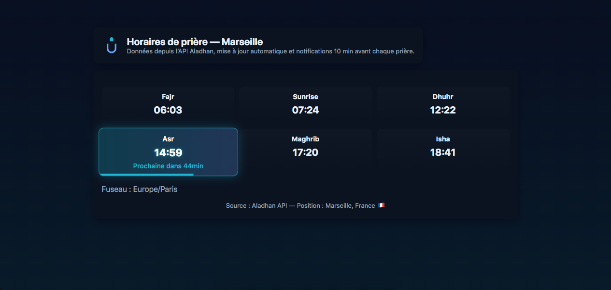

# Muslim Prayer Times — Marseille 🕌

[](https://developer.mozilla.org/fr/docs/Web/HTML) 
[](https://developer.mozilla.org/fr/docs/Web/CSS) 
[](https://developer.mozilla.org/fr/docs/Web/JavaScript)
[](https://aladhan.com/prayer-times-api)

---

## Description

Application web légère en **HTML, CSS et JavaScript** affichant les **horaires de prière musulmans pour Marseille** avec mises à jour en temps réel.  

**Fonctionnalités :**
- Récupération automatique des horaires via l’**API Aladhan**.
- Mise à jour toutes les **10 minutes**.
- Mise en évidence de la **prière actuelle** avec **barre de progression turquoise**.
- **Compte à rebours dynamique** à l’intérieur de la case de la prière active.
- **Transitions fluides** sur 1 seconde lors du passage à la prière suivante.
- Notifications locales **10 minutes avant chaque prière** (si autorisées par le navigateur).
- Interface **responsive**, adaptée à tous les appareils.

---

## Aperçu



---

## Installation / Utilisation

1. Clonez le dépôt :
```bash
git clone https://github.com/ton-utilisateur/Muslim-Prayer-Times-Marseille.git
